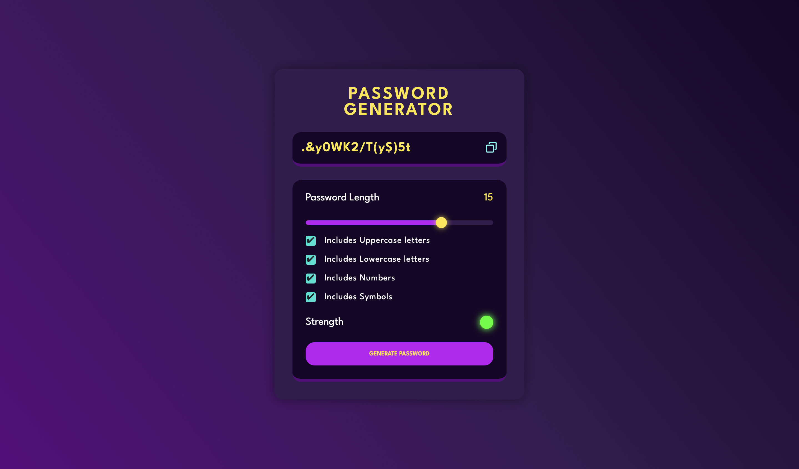

# Password Generator

A simple and functional password generator that allows users to generate strong passwords based on selected criteria such as length, and the inclusion of uppercase letters, lowercase letters, numbers, and symbols. This password generator is designed to provide strong, secure passwords in a user-friendly and minimalistic interface.

## Features

- **Password Length Control**: Adjust the length of the password (between 1 and 20 characters).
- **Character Type Selection**: Options to include/exclude:
  - Uppercase Letters
  - Lowercase Letters
  - Numbers
  - Symbols
- **Password Strength Indicator**: Visual indicator of the strength of the password based on the selected options.
- **Copy to Clipboard**: Easily copy the generated password to the clipboard for quick use.
- **Responsive Design**: Works seamlessly across various device sizes (desktop, tablet, and mobile).

## Technologies Used

- **HTML5**: Markup language for structuring the content.
- **CSS3**: Styling to create a visually appealing and responsive design.
- **JavaScript (ES6)**: Core logic to generate passwords, manage UI interactions, and copy to clipboard functionality.

## Screenshots

### Password Generator Interface


## How to Use

1. **Adjust Password Length**: Use the slider to set the desired length of your password.
2. **Select Character Types**: Check the boxes to include Uppercase letters, Lowercase letters, Numbers, or Symbols.
3. **Generate Password**: Click the "Generate Password" button to create a new password.
4. **Copy Password**: Click the copy icon next to the generated password to copy it to your clipboard.
5. **View Password Strength**: The strength of the password is displayed with a color indicator based on the options selected and password length.

## Setup & Installation

1. Clone the repository:
   ```bash
   git clone https://github.com/abhisheksingh789/Password-Generator.git
   ```

2. Navigate to the project directory:
   ```bash
   cd Password-Generator
   ```

3. Open the `index.html` file in your browser to start using the password generator.

## License

This project is licensed under the [MIT License](./LICENSE). You are free to use, modify, and distribute this project as per the license.

## Contributions

Contributions and suggestions for improvements are always welcome! Feel free to fork the repository and submit pull requests.